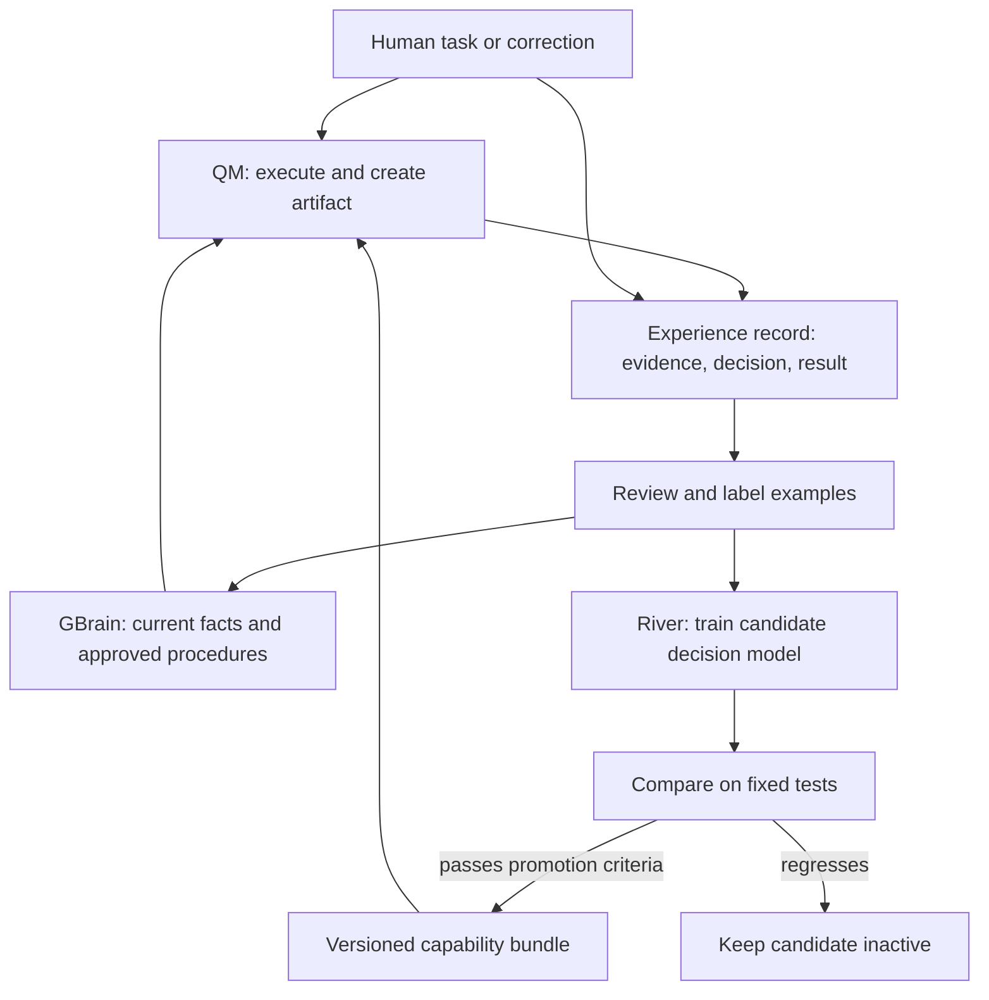

# QM × GBrain × River: what is missing, and what to demo

Prepared September 27, 2026. Based on public documentation and selected source inspection, with separate notes in [QM-RESEARCH.md](QM-RESEARCH.md), [GBRAIN-RESEARCH.md](GBRAIN-RESEARCH.md), and [RIVER-RESEARCH.md](RIVER-RESEARCH.md). No integration or training experiment has been run. Feasibility rankings are judgments, assuming a working QM instance and sponsor access.

## The opportunity

Build an agent whose improvement is visible and transferable. The compelling experience is: **watch it work, teach it, challenge it, and give the tested capability to another agent.**

The three products already overlap. QM has memory and shared skills; GBrain has execution and skill optimization; River has evaluation and tool-training support. Describing them only as “hands, memory, and learning” is useful architecture shorthand but understates their actual capabilities.

The opportunity is the complete user journey across them: a work outcome becomes reviewed evidence, evidence becomes a tested capability, and that capability returns to work with an identifiable version. I did not establish that this is absent from every branch or private roadmap. It is the strongest integration opportunity found in the reviewed public surfaces.

## Weaknesses that matter to a demo

| System | What already works in its documented design | Confirmed boundaries | Product opportunity — our inference |
|---|---|---|---|
| QM | Scoped execution, durable work, shared skills, multiple harnesses, external memory providers, and durable agent swarms. | Swarm agent-board UI is deferred; swarms do not add filesystem snapshots/restores. Production durability needs the appropriate Postgres stores. | Give people a visual view of what agents decided, what changed, and whether a new behavior improves outcomes. |
| GBrain | Knowledge retrieval, portable procedures, SkillOpt, a QM integration recipe, and a voice reference. | Documented SkillOpt primarily optimizes skill prompt bodies. Source includes write-capture scaffolding but its normal optimization path needs verification. Voice cross-call memory is deferred in the reference. QM recipe read isolation is per source, not employee prefix. | Connect knowledge and procedures to evaluated actions; preserve evidence and scope when teaching or transferring capabilities. |
| River | SFT, RL, distillation, checkpointing, evaluation support, and serving. | Models are account-gated; dedicated serving requires a team key with deployment access. A saved LoRA adapter depends on its base model. | Turn ordinary corrections into useful supervision and make checkpoint selection understandable to an operator. |

Sources: [QM overview](https://github.com/yc-software/qm), [QM swarms](https://github.com/yc-software/qm/blob/main/docs/swarms.md), [QM memory providers](https://github.com/yc-software/qm/blob/main/docs/memory-providers.md), [GBrain QM integration](https://github.com/garrytan/gbrain/blob/master/docs/integrations/qm-harness.md), [SkillOpt](https://github.com/garrytan/gbrain/blob/master/docs/guides/skillopt.md), [voice reference](https://github.com/garrytan/gbrain/blob/master/recipes/agent-voice.md), [River overview](https://docs.river.ai/), [River models](https://docs.river.ai/guides/models/), [River serving](https://docs.river.ai/guides/deployments/), [LoRA](https://docs.river.ai/guides/lora/). Detailed SkillOpt code citations are in the GBrain note.

A second practical weakness is integration ambiguity. GBrain's QM guide describes some native attachment work as deferred, while current QM already exposes an external MCP memory-provider router. Treat these as documentation from potentially different implementation stages; verify the installed versions and exact schemas. The CLI integration is a documented fallback. A diagram alone does not establish interoperability.

## Eight demo directions

These are proposed experiences, not existing capabilities or measured results.

| Concept | The on-stage moment | How the pieces fit | Added component | Scope/risk |
|---|---|---|---|---|
| **The Apprentice** | You correct an agent managing a tiny startup. It handles a new surprise correctly; another agent inherits the tested skill. | QM does the work; GBrain stores rules/evidence; River trains one decision skill. | A visual task simulator and learning-review screen. | Best balanced choice if training access works; narrow the learned skill. |
| **Brain Transplant** | Start a fresh agent with no teaching conversation. Load a capability bundle and repeat a reserved challenge. | QM supplies a fresh session, GBrain the approved procedure, River the adapter. | Bundle manifest, import control, and comparison harness. | Best expression of “own your intelligence”; distinguish procedure transfer from weight learning. |
| **Agent Time Machine** | Change one incorrect assumption in a timeline. Only dependent drafts replay, with visible differences. | QM executes the replay; GBrain versions evidence; River can learn the recurring decision that failed. | Dependency tracking, saved inputs, branch/replay UI. | Best visual alternative. River is optional unless a real learning experiment is added. |
| **Call Your Future Self** | Delegate by voice, hang up, then call back to completed work. A later correction changes future behavior. | QM keeps work alive; GBrain supplies continuity; River optionally learns intent routing or a recurring decision. | Authenticated call-to-job bridge and cross-call state. | Strongest personal demo; phone provisioning and voice latency can dominate. |
| **Merge Our Brains** | Two people disagree about how their agent should act. Resolve one conflict; a shared agent passes both people's tests. | QM enforces scopes; GBrain holds separate/shared rules; River learns approved combined examples. | Conflict review, attribution, and scoped publication. | Strong multiplayer story. Merge approved knowledge/examples, not arbitrary neural weights. |
| **Agent Olympics** | An untrained and trained agent face the same surprise obstacles: ambiguous owner, stale deadline, missing approval. | QM runs contestants; GBrain gives controlled evidence; River supplies checkpoints. | Resettable game environment and objective scoreboard. | Most entertaining. Keep one task family so it measures a real capability. |
| **Watch Me Once** | You demonstrate one workflow in a tiny web app; the apprentice performs a changed version and asks at the right ambiguity. | QM executes actions; GBrain stores the demonstrated procedure; River learns one narrow step. | Event recorder and sandbox replay. | High wow, high risk. A single demonstration cannot substantiate general computer-use learning. |
| **Memory Court** | Two conflicting memories argue their cases with evidence. A human resolves the conflict; affected artifacts update. | GBrain supplies conflicting evidence, QM traces downstream effects, River optionally learns which cases require escalation. | Evidence inspection and impact graph. | Excellent trust demo; River is less essential. |

My ranking: **The Apprentice** for combining all three; **Agent Time Machine** for visual clarity and reduced training dependency; **Call Your Future Self** for a product you could immediately want to use. Brain Transplant makes a strong finale for The Apprentice.

## Recommended demo: The Apprentice

**Pitch:** “Your best judgment should become something your whole team can use.”

The screen is a small animated startup workspace: incoming requests, an agent at work, artifacts it creates, and the outcome of each decision. Judges can understand the state without reading a long chat transcript. Use cards and a simple task board; a 3D world is optional decoration after the mechanism works.

The bounded task is customer-commitment handling. For each incoming request, the agent must choose `draft`, `clarify`, or `escalate`, then produce a follow-up draft. Current project facts are supplied as inputs. One stable convention is that a suggestion about who might own work is not an accepted commitment.

Training focuses on the decision and its structured reason. QM's general agent performs the broader drafting workflow. This lets a small learned component be useful without claiming that a whole autonomous employee was trained during the hackathon.

### Four-minute story

1. **Watch it work.** A synthetic customer asks for a delivery date. The baseline treats “Maya could probably do it” as an accepted assignment. Show the proposed draft and the exact evidence it used. Use a failure genuinely observed during development; never force the baseline to fail through hidden instructions.
2. **Teach it.** Say or type: “A suggestion is not an accepted commitment. Ask for confirmation.” The application proposes a scoped procedure change and shows supporting examples. Store an approved version in GBrain.
3. **Try something new.** A new request says “I can take it, but only after the migration.” The evaluation checks whether the agent preserves the condition instead of blindly applying the previous example. Include already-accepted commitments so a blanket refusal does not look like improvement.
4. **Show the training lineage.** Display a River checkpoint trained earlier on reviewed examples, its dataset version, and its evaluation. A correction made on stage can enter a new candidate batch; it has not affected existing weights. If a live training run finishes, show its actual state and result. Otherwise, say it is pending.
5. **Transfer the capability.** Open a fresh QM agent with the checkpoint and the required current facts, excluding the old teaching conversation. Run a fresh challenge. Separately test with and without the explicit procedure so the audience can see what came from memory and what came from weights.
6. **Try a bad lesson.** A broader proposed rule—“Never commit to a date”—fails a case where an owner has explicitly accepted. Keep the candidate inactive. This final beat demonstrates judgment in how the system learns.

The strongest reveal is an understandable behavior on a new task, followed by a capability bundle with its evidence and limitations. Training loss alone is not the reveal.

### What the architecture actually needs

The additional code is an experience record, a narrow simulator, a review/evaluation loop, and a UI. Reuse the actual memory and execution systems.

An experience record should link: task ID, QM run ID, scope, evidence page/version IDs, model/checkpoint, proposed action, correction, label, and observed result. Version the task schema and evaluator. Permission to retrieve information does not automatically mean it should be published as a shared skill or included in a shared training set; make publication explicit in the product flow.

Store changing facts in GBrain. Keep action authorization in QM/application code. Train stable decision behavior in River. A new deadline should update a fact; it should not require retraining the model.

### Two practical River paths

**Preferred MVP:** QM calls a specialist tool that sends the bounded decision input to a Python worker. The worker samples a saved River checkpoint and returns validated structured data. This avoids replacing QM's entire general-purpose model. Queued sampling is documented, but interactive latency must be measured. [River request lifecycle](https://docs.river.ai/guides/requests/)

**If dedicated serving is enabled:** register the River endpoint through QM's custom-provider support and use its Pi path for the selected task. Verify text/tool behavior and checkpoint rollout in the running deployment; API resemblance alone is insufficient. [QM custom-provider source](https://github.com/yc-software/qm/blob/main/src/model/custom-providers.ts), [River serving](https://docs.river.ai/guides/deployments/)

For GBrain, prefer the documented sandbox CLI integration initially. Adopt QM's generic memory-provider router only after validating tool schemas, authentication, scope mapping, and capture behavior against the chosen GBrain version. Keep source IDs and evidence versions in our experience record even if recall arrives as text.

## Evidence that makes this credible

Compare four conditions on the same task inputs and current facts: base model; base plus explicit procedure; trained model plus procedure; trained model without procedure. Keep generation settings matched. This answers whether a good prompt already solved the task and whether training contributed anything.

Use separate training, development, and final evaluation cases. As a pilot planning target, prepare dozens of reviewed examples plus a genuinely withheld evaluation set; the required quantity depends on observed learning and error diversity. Group closely related paraphrases together to avoid leakage. The existing meeting examples are useful seeds, not an adequate generalization claim.

The scorer should check permitted decision, owner acceptance, preserved conditions, schema validity, and outcome. Draft style can be reviewed separately. Do not let a model award itself the only success score. Measure the whole path for any latency/cost claim. Report exact counts and the small synthetic scope.

Use the final holdout once after selecting the checkpoint on development data. If the trained model loses to the prompted baseline, keep that finding. The product's promotion gate is still useful, but the demo cannot claim a successful weight-learning result.

## Build scope for the hackathon

The prior preparation budget is 225 minutes. Treat this as a conditional plan, not a promise that all accounts and deployments can be provisioned in that time.

| Minutes | Work |
|---|---|
| 0–25 | Confirm working QM/GBrain connections and River sampling/checkpoint access. Pick one task and an objective evaluator. |
| 25–65 | Working baseline and a simple visual task board. Save decision/evidence records. |
| 65–115 | Correction review, GBrain procedure version, River candidate run. |
| 115–160 | Matched evaluation, checkpoint selection, fresh-agent transfer. |
| 160–195 | Make the story legible; add one optional dramatic element. |
| 195–225 | Rehearse, reset, record, and prepare submission. |

If setup consumes the first block without a working run, reduce scope immediately: use the already working harness and describe exactly which sponsor integrations are live. If River cannot produce an evaluated checkpoint in time, ship The Apprentice as procedure learning and show the River experiment status honestly. It then becomes a two-system demo with a planned training extension.

**One stretch feature:** voice teaching if credentials already work, or a live judge-authored challenge if they do not. These intensify the central story. Multiple autonomous roles, phone provisioning, full desktop recording, and arbitrary workflow replay each deserve a separate project.

## Concrete recommendation

Build **The Apprentice**, stage it as **Agent Olympics**, and end with **Brain Transplant**. That is one narrow product loop presented in three beats: teach, challenge, transfer. Keep voice as an optional interface.

If real training access or the dataset is not ready, choose **Agent Time Machine** and make a precise claim about replaying local drafts. Its visual payoff is strong even without model improvement, and it can feed future training examples into the same architecture.
