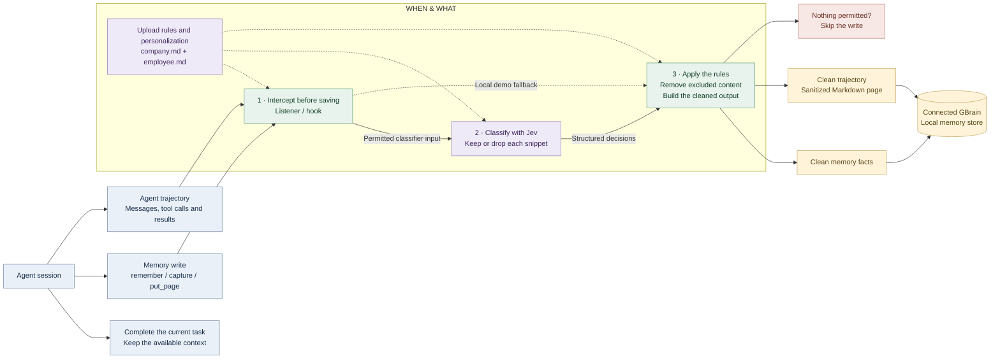

# When & What — product pipeline

**Use the context now. Choose what survives.**

An agent completes its task with the conversation it is allowed to use. When it tries to save a memory or archive its trajectory, When & What intercepts the content, applies company and employee rules, and forwards only the permitted parts to GBrain.

## The diagram

This is the proposed product flow. The implementation status is listed below.

## What someone sees in the demo

1. **Connect:** Jev as the classifier; local GBrain as the destination. Display whether each connection is live or simulated.
2. **Set the rules:** upload `company.md` and `maya.md`, or edit them in place. Company restrictions take precedence; employee preferences can restrict them further.
3. **Run a sample:** send a memory write or upload a JSONL trajectory. The listener catches it before storage.
4. **Watch the transformation:** highlight excluded snippets and show the exact cleaned payload. This is an automatic result, with no approval queue.
5. **Save and inspect:** show the permitted facts and a cleaned trajectory page in GBrain, once dispatch is connected.
6. **Change one rule:** exclude writing preferences, replay the sample, and watch the next output change.

## The moment that makes it click

| Input contains | What survives in memory and the stored trajectory |
| --- | --- |
| “Maya has an oncology appointment Friday.” | Removed. |
| “Ravi covers enterprise escalations Friday.” | Coverage retained; expiry requested for the end of Friday. |
| “Maya prefers three-bullet updates.” | Retained only in a destination authorized for Maya. Otherwise omitted. |
| A credential in a tool result | Removed, including repeated copies elsewhere in the trajectory. |

**The current task keeps its available context. The persistent copy contains only the permitted content.**

## Keep the implementation small

- **Jev decides; the hook edits.** Split content into numbered snippets and ask Jev for typed keep/drop decisions and category labels. Our code assembles the surviving text. Jev is designed for structured decisions rather than generated prose. [TypeSafe’s introduction](https://typesafe.ai/blog/introducing-system-one-models-and-jev)
- **The classifier follows the rules too.** Before calling hosted Jev, check what may leave the local environment. Restricted content takes the local path. For this demo, use synthetic data and label the deterministic fallback clearly.
- **A cleaned trajectory is a new artifact.** Sanitize message text, tool arguments, results and metadata—not just memory calls. Preserve event order and useful actions. Never append the original trace to the cleaned page. Unsupported or uncertain content is omitted from the stored copy.
- **Store it as ordinary Markdown.** Use GBrain `capture` or `put_page` for a page such as `trajectories/demo-session-001`; use `remember` for individual facts. GBrain’s local [page operations](../.local/gbrain/src/core/ops/pages.ts) accept Markdown content. The app still needs to connect this path.
- **Storage permission is separate from training permission.** Keep training disabled for the demo. Audience and expiry labels need enforcement; labels alone do not create access controls. A preference change affects future writes here, not previously stored records.

## What exists today

| Part | Status |
| --- | --- |
| Markdown editor/upload and JSON/JSONL input | Working in the demo UI. |
| Intercept and edit recognized memory calls | Working when replaying an uploaded trajectory; deterministic rules. |
| Live agent listener | Proposed connection; the current demo uses replay. |
| Jev connection | Proposed; no live Jev classification yet. |
| Local GBrain | Set up and separately verified. Dispatch from the hook is simulated. |
| Sanitize and store the whole trajectory | Proposed; current user/assistant messages remain untouched and are not forwarded. |

For the presentation, the central visual is **input → listener → Jev + rules → cleaned output → GBrain**. Animate one synthetic message through that path, then repeat it after a rule change.
